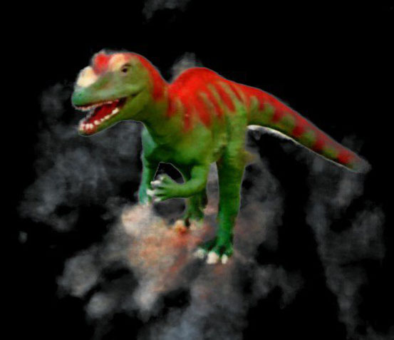
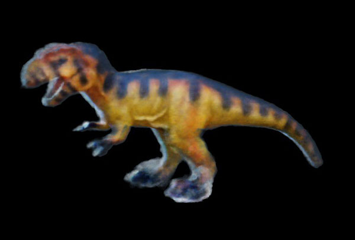
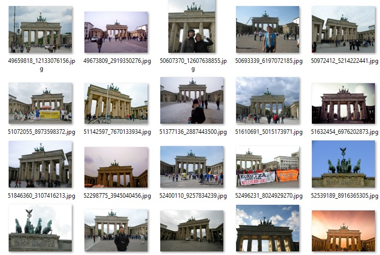
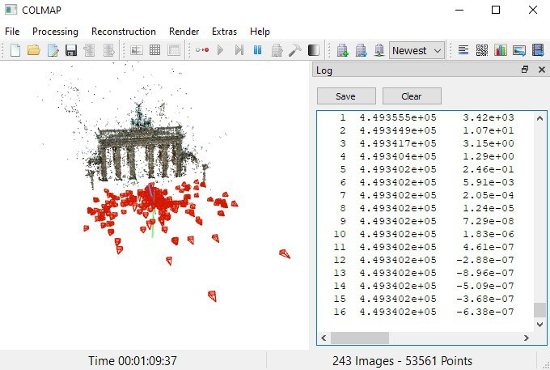
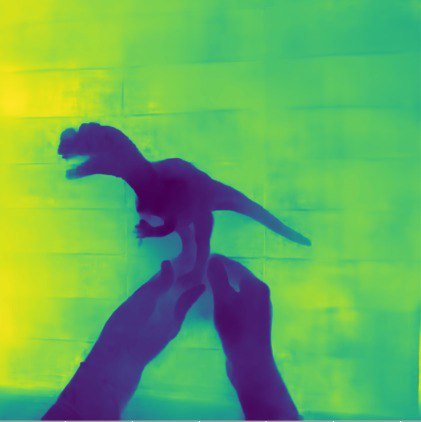
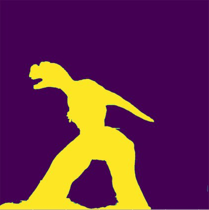
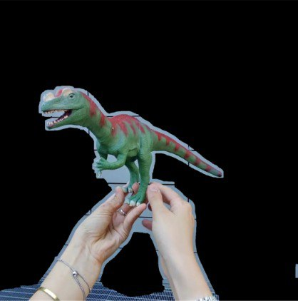
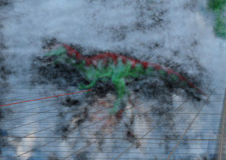
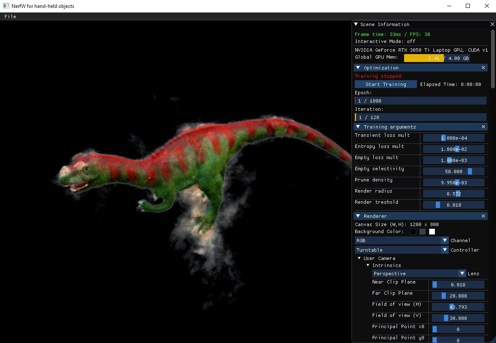

# instantNeRFW for hand-held object reconstruction

This project fuses [NeRF in the Wild](https://nerf-w.github.io/) with [instant NeRF](https://nvlabs.github.io/instant-ngp/) to speed up the generation of NeRFs with occlusions. 
The goal is to be able to reconstruct hand held objects without the hands or the background.
The project was developed using the library [kaolin-wisp](https://github.com/NVIDIAGameWorks/kaolin-wisp) from nvidia.

  

## Installation

For the installation follow the instructions [here](/resources/installation.md)

## Implementation details

This work takes builds on the work of NeRF in the Wild to create NeRFs able to handle occlusions, but we made multiple changes in order to speed up the training and rendering. 

The most substantial are:
- removal of the spatial integration of the transient
- removal of the uncertainty factor
- static scene modelled with hash encoding

Every transient field is integrated always from the point of view of the corresponding camera, so there is really no point in computing the integration every time. 
Instead we propose to learn a two dimensional transient and density to be added in front of the camera.

If there is a transient object in front of a ray we stil want the color of the transient to be the same color of the image pixel, so we chose to further save the computation by not computing the transient colors but onòy the densities of the transient. This can be just be seen as a discount factor for the RGB loss worh the points that are occluded.

When trying to reconstruct hand held objects rotated in front of the camera the background tends to stay the same and match too much in all the images. This causes the creation of a fog around the object in most cases. More rarely it matches more than the object we are tryng to reconstruct, that is then modelled as a hole in the fog or just plainly put in the trainsients.
In orderd to aleviate this problem we introduced two regularizers:
- entropy regularizer
- empty background regularizer

For further details see the [technical report](/resources/report.pdf).

## Computing the positions of the cameras

To compute the positions of the cameras we used colmap.

  

1. Place the images in a single folder
2. Open colmap, File > New project, create a new database (place it somewhere) and select the image folder
3. Processing > Feature Extraction, eventually select the mask path folder (masks need to have the same name of the images + _.png_, e.g. _1.jpg_ and _1.jpg.png_)
4. Processing > Feature Matching
5. Reconstruction > Start Reconstruction
6. Extras > Undistort
7. File > Export model as text

Then we have to convert the camera informations to the format accepted by wisp.

1. Place the colmap model txt file in /datasets/\<dataset_name\> and copy the undistorted images in /datasets/\<dataset_name\>/images
2. Run from the main project directory:
```bash
python ./utils/colmap2wisp.py --images ./datasets/<dataset_name>/images/ --text ./datasets/<dataset_name>/ --out ./datasets/<dataset_name>/ [--aabb_scale 2]
```
the aabb_scale sets the size of the scene, so how far the rays go during the integration (can also be changed later from the library)

WARNING: at the time of writing kaolin-wisp datasets support only dataset with images of the same shape. For semplicity better crop the images before using Colmap

## Reconstrucion


## Hand held objects

Reconstructing an hand held object poses more challenges than simply reconstructing a scene with transient occlusions.

### Camera position estimation


The first problem we encounter is the matching of the cameras. Naively matching the images results in colmap matching the background instead of the object we are trying to recosntruct. 
In order to be able to compute the camera positions relative to the object we need to mask the background before doing the feature extraction.
The dataset we used had an approximate depth map for each image, so we used that to compute an approximate mask for the images. The mask doesn't need to be perfect to work.

   

### Fog removal and other artifacts
The transient is able to handle pretty well the removal of the hands.
The only exception is when the hands are in the same position in too many images (for example in the greendino dataset where it's nearly alwasy hold by the feet) they get confused as a static element and they start to appear also in the static scene.

The real problem is the matching of the background. When rotating an object in front of a background the colors of the background match so much in nearly all the images that they start to appear as a fog around the object. The backgorund matches so much that if we decrease the penalty for using the transient the model choses to put the object in the transient and model the static scene as a nearly uniform fog.



Removing the background using a mask could solve the issue, but that requires a pretty precise mask, otherwise it will still make a kind of aura around the object.

In order to solve the issue we chose to make the backgorund color of the ray (the color at the end of the integration) to be a learnable parameter of the NeRF, hoping that if the background is uniform enough the color is handled by the background of the ray, with all the non uniform parts (e.g. the black lines in the greendino) being instead handled by the trainsient.

To further push the model to not make a fog around the object we introduced two regularization losses:
- **Entropy loss**: a loss on the density of the static scene, that pushes every point of the space to either be occupied (density 1) or be empty (density 0). It was loosely inspired by [InfoNeRF](https://arxiv.org/abs/2112.15399)
- **Empty background loss**: a loss on the alpha (cumulative density) of the ray, that pushes the ray to be transparent (have density 0) if the target color is very close to the background color. The selectivity factor can be tuned depending on how similar the color of the object is compared to the background.


The tuning of these regularizer losses can be tricky: a high entropy loss can significanly slow down the training making it more likely to get stuck in a bad local minima; a high empty loss can instead confuse part of the object as background creating holes in the reconstruction. To help tune these parameters we added stliders to the GUI in order to be able to modify them while the model is training.

The model tends to put more fog in places that are not between the object and the camera, meaning that usually the worse artifacts are further from the center and outside the radious of the cameras. For this reason we added a slider to select the rendering radius, in order to make it small enough to stay inside the clean region. For the same reson training with a lower aabb scale (scene size) can sometimes lead to more noise close to the model.

Finally since most of the unwanted fog usually has density lower thant the object we want to recreate we also set a slider to select the minimum density to be rendered, discarding all the samples with lower density.



Work under the NVIDIA Source Code License


